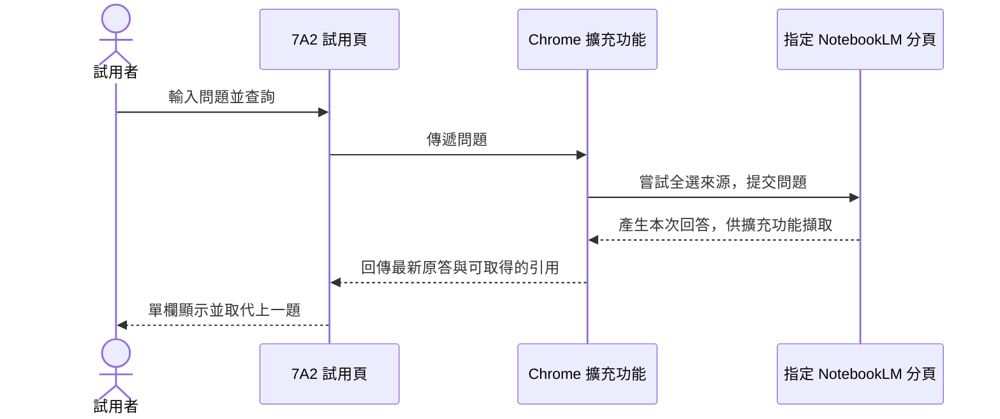
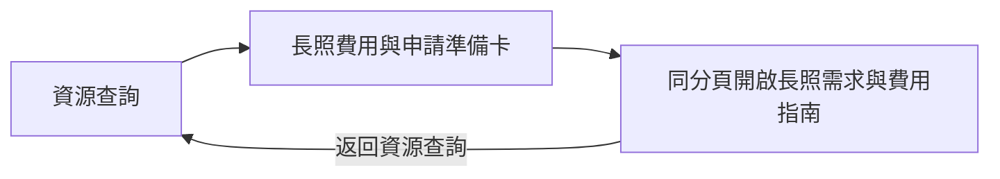

# 7A2 資訊流

## 一次查詢

```mermaid
sequenceDiagram
    actor U as 試用者
    participant F as 7A2 試用頁
    participant E as Chrome 擴充功能
    participant N as 指定 NotebookLM 分頁
    U->>F: 輸入問題並查詢
    F->>E: 傳遞問題
    E->>N: 嘗試全選來源，提交問題
    N-->>E: 產生本次回答，供擴充功能擷取
    E-->>F: 回傳最新原答與可取得的引用
    F-->>U: 單欄顯示並取代上一題
```

## 指南導覽

```mermaid
flowchart LR
    A["資源查詢"] --> B["長照費用與申請準備卡"]
    B --> C["同分頁開啟長照需求與費用指南"]
    C -->|"返回資源查詢"| A
```
