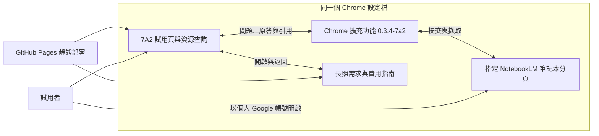

# 7A2 系統架構

```mermaid
flowchart LR
    U["試用者"]
    subgraph Chrome["同一個 Chrome 設定檔"]
        F["7A2 試用頁與資源查詢"]
        E["Chrome 擴充功能 0.3.4-7a2"]
        N["指定 NotebookLM 筆記本分頁"]
        G["長照需求與費用指南"]
        F <-->|"問題、原答與引用"| E
        E <-->|"提交與擷取"| N
        F <-->|"開啟與返回"| G
    end
    P["GitHub Pages 靜態部署"] --> F
    P --> G
    U --> F
    U -->|"以個人 Google 帳號開啟"| N
```

Pages 提供試用頁和指南，NotebookLM 產生來源問答，擴充功能橋接兩個分頁。
